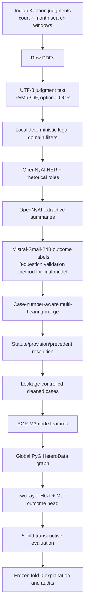

# Framework and Data Acquisition

This document explains how the thesis framework acquires court judgments, converts
them into a leakage-controlled heterogeneous graph, trains the outcome model, and
produces explanations. It distinguishes between:

1. the intended high-level pipeline;
2. the code paths that are currently implemented; and
3. the exact lineage of the final entity-resolved, section-separated model used by
   `FINAL_EXPLANATION`.

The repository was audited for this document on **5 July 2026**. Where a README or
thesis paragraph differs from executable code or saved artifacts, the code, active
configuration, and artifact metadata are treated as the source of truth.

---

## 1. What the framework does

The research task is case-outcome prediction from Indian court judgments. The
framework does not treat a judgment as one flat text document. It represents each
case as a typed local graph containing:

- non-decisive text sections such as the preamble, facts, and party arguments;
- parties, lawyers, court, and judges;
- cited statutes, provisions, and precedents; and
- typed relations between those objects.

Statutes, provisions, and precedents can be shared between cases. They therefore
connect otherwise separate case-star graphs into one global legal graph. A
Heterogeneous Graph Transformer (HGT) combines the case's text representation with
messages from its typed legal neighborhood and predicts the outcome at the `case`
node.

The final implemented target is:

```text
positive (+1): appellant/petitioner won
negative (-1): appellant/petitioner lost OR the outcome was procedural/postponed
```

This point matters: the final configuration maps the original procedural score `0`
to `-1`; it does not discard procedural cases.

---

## 2. End-to-end architecture



The main repository folders implement these stages:

| Stage | Folder | Responsibility |
|---|---|---|
| Collection and text | `INPUT_DATA/` | Local raw PDFs, extracted text, PDF-to-text utility |
| NLP and labels | `Fixed_GPU_OpenNyai/` | NER, rhetorical roles, summaries, Mistral labels |
| Dataset construction | `DATA_SET_BUILDER_AND_EXPLORER/Timeline_Maker/` | Hearing merge, combined dataset, entity resolution |
| Graph and model | `section_GNN/` | Leakage preprocessing, graph construction, HGT training |
| Explanation | `FINAL_EXPLANATION/` | Counterfactuals, validation, community analysis, traceability |

---

## 3. Data acquisition

### 3.1 Judgment source

The thesis identifies **Indian Kanoon** (`indiankanoon.org`) as the source of the
judgments. The acquisition method described in the thesis is:

1. choose a target High Court;
2. divide the required time range into calendar-month windows;
3. issue a bounded query such as:

   ```text
   doctypes:<court> fromdate:1-<month>-<year> todate:<last-day>-<month>-<year>
   ```

4. enumerate and download the judgments in that court-month window as PDFs; and
5. avoid downloading the same numeric Indian Kanoon document identifier twice.

The thesis reports that a broad Indian Kanoon query is practically limited to about
40 result pages, or roughly 400 accessible documents. Court-month partitioning keeps
each query below that practical result limit and reduces the bias that would arise
from collecting only highly ranked results from a broad keyword query.

This is a *window-complete acquisition strategy*, not a random sample: the intention
is to retrieve all accessible results in every selected court-month window and then
classify them locally.

### 3.2 Local domain bucketing

Domain membership was assigned after download rather than by relying only on the
search engine's ranking. The thesis states that a local deterministic filter matched
statutory patterns and contextual keywords in extracted judgment text. Examples
include:

- family and matrimonial: IPC 498A and related matrimonial/dowry terms;
- financial fraud: IPC 420, 468, 471 and related economic-offence terms;
- land and property: land acquisition, title, and property statutes;
- motor accidents: Motor Vehicles Act and compensation provisions; and
- sexual offences: IPC/CrPC and POCSO-related provisions.

Food safety is maintained as a held-out domain for cross-domain evaluation and is
not included in the five-domain pooled training graph.

### 3.3 Current local source inventory

The checked-out local data currently contains the following plain-text corpus:

| Domain directory | `.txt` judgments | Filename year range |
|---|---:|---|
| `family_matrimonial_text` | 15,804 | 2023–2026 |
| `financial_fraud_text` | 15,022 | 2023–2026 |
| `land_property_text` | 14,153 | 2023–2026 |
| `motor_accidents_text` | 15,134 | 2023–2026 |
| `sexual_offences_text` | 15,537 | 2023–2026 |
| **Five-domain total** | **75,650** | |
| `food_safety_text` | 13,385 | 2010–2026 |

The year ranges are derived from filenames and are descriptive, not authoritative
collection bounds. Some filenames do not match the standard date pattern.

At present, `INPUT_DATA/financial_fraud/` retains 15,022 PDFs. The other main raw
domain directories contain only placeholder documentation, while their extracted
text folders are present locally.

### 3.4 What is and is not reproducible from this repository

The repository includes `INPUT_DATA/01_extract_pdf_text.py`, but it does **not**
contain the original Indian Kanoon crawler or the deterministic domain-filter
implementation. It also does not contain a complete acquisition manifest recording:

- the target High Court list;
- exact start and end dates;
- every query URL;
- Indian Kanoon document IDs and source URLs;
- download timestamps and HTTP status;
- content hashes;
- the exact per-domain regular expressions; or
- the collection-time access-policy/terms snapshot.

Therefore:

- the pipeline is reproducible from already acquired PDFs or text onward;
- the final modeling corpus is locally auditable; but
- raw acquisition from Indian Kanoon cannot currently be independently reproduced
  using only versioned repository code.

For a publication-grade acquisition release, the missing crawler, filter rules, and
immutable source manifest should be added, subject to the source site's current
access policy and redistribution conditions.

---

## 4. PDF-to-text conversion

The implemented extractor is `INPUT_DATA/01_extract_pdf_text.py`.

For every recursively discovered PDF it:

1. opens the file with PyMuPDF (`fitz`);
2. concatenates `page.get_text("text")` across pages;
3. if fewer than 200 non-whitespace characters were extracted, renders each page at
   300 DPI and attempts English OCR with Tesseract through `pytesseract`;
4. replaces form-feed characters with line breaks;
5. collapses repeated spaces/tabs and excessive blank lines; and
6. writes `<pdf-stem>.txt` as UTF-8.

Example:

```bash
micromamba run -n fixed_gpu_opennyai_final python \
  INPUT_DATA/01_extract_pdf_text.py \
  --input-dir INPUT_DATA/financial_fraud \
  --output-dir INPUT_DATA/financial_fraud_text
```

Important implementation detail: the 200-character threshold triggers OCR; it does
not cause the file to be skipped. The script writes the resulting text even when OCR
dependencies are unavailable or extraction remains empty. A downstream corpus audit
should consequently verify non-empty text, minimum length, and extraction quality.

---

## 5. Legal NLP enrichment

### 5.1 NER and rhetorical roles

`Fixed_GPU_OpenNyai/run_ner_rr_custom.py` runs the OpenNyAI pipeline with:

```python
Pipeline(
    components=["NER", "Rhetorical_Role"],
    use_gpu=True,
)
```

The production environment pins `opennyai==0.0.13`, `spacy==3.2.4`,
`pydantic==1.7.4`, CUDA-enabled PyTorch, and CuPy.

The runner:

- discovers all `.txt` files recursively;
- creates a stable ASCII internal identifier from relative path plus a SHA-1 suffix;
- runs one worker per selected GPU;
- supports per-worker document batches;
- skips already written outputs on resume;
- isolates failures per document;
- supervises frozen workers and can defer problematic files; and
- falls back to NER-only output if the rhetorical-role pipeline fails because sentence
  boundaries are unavailable.

Each successful annotation JSON has this essential shape:

```json
{
  "file_id": "case filename stem",
  "rr_available": true,
  "preamble_end_char_offset": 1234,
  "sentences": [
    {
      "sentence_id": 1,
      "text": "Judgment sentence",
      "rhetorical_role": "PREAMBLE",
      "start": 0,
      "end": 42,
      "entities": [
        {
          "text": "Supreme Court",
          "label": "COURT",
          "start": 10,
          "end": 23
        }
      ]
    }
  ],
  "ner_by_label": {},
  "rr_by_role": {}
}
```

The relevant rhetorical roles include:

| Role | Meaning/use |
|---|---|
| `PREAMBLE` | case heading, court, parties, counsel |
| `FAC` | factual background |
| `ARG_PETITIONER` | petitioner's/appellant's arguments |
| `ARG_RESPONDENT` | respondent's arguments |
| `PRE_RELIED`, `PRE_NOT_RELIED`, `STA` | cited-law/other argument material |
| `ANALYSIS`, `ISSUE`, `RATIO`, `RLC`, `RPC`, `NONE` | removed by final preprocessing |

The main extraction wrapper is:

```bash
cd Fixed_GPU_OpenNyai
bash run_scripts/run_ner_rr_all_categories.sh --gpus 0,1,2,3
```

Its outputs are:

```text
final_outputs/<bucket>_extract/annotations/*.json
```

### 5.2 OpenNyAI extractive summaries

`run_opennyai_summarizer_custom.py` reconstructs the OpenNyAI annotation format from
the sentence JSON and runs `ExtractiveSummarizer`. It preserves the original sentence
and entity records while adding:

- `in_summary`;
- `summary_section`;
- `summary_sent_score`;
- top-level `opennyai_summary`; and
- `summary_status`/`summary_error`.

The summary normally has `PREAMBLE`, `facts`, `arguments`, and `decision` blocks.
The `decision` block is used to create the target label but is not retained as model
input.

Run:

```bash
bash run_scripts/run_opennyai_summaries_all.sh --gpus 0,1,2,3
```

Output:

```text
final_outputs/<bucket>_summary_opennyai/enriched_jsons/*.json
```

---

## 6. Outcome-label acquisition

Outcome labels are machine annotations, not court-provided structured labels. They
are derived only from the decision summary and `RPC` sentences, which are later
excluded from graph features.

### 6.1 First-pass labeler

The first-pass labeler uses
`mistralai/Mistral-Small-24B-Instruct-2501` through local vLLM by default. It asks
for one JSON classification:

| Label | Score | Interpretation |
|---|---:|---|
| `appellant_won` | `1` | requested relief granted |
| `postponed_or_procedural` | `0` | remand, adjournment, interim or unclear final outcome |
| `appellant_lost` | `-1` | requested relief refused |

Generation uses temperature `0.0`, validates label/score consistency, and stores the
model response, confidence, explanation, decision text, and RPC evidence for audit.

### 6.2 Independent eight-question label method

The validation labeler in
`extra_scripts/add_case_outcome_labels_crossval_mistral.py` asks the same model eight
binary questions in one call:

- Q1–Q3: appellant-win signals;
- Q4–Q6: appellant-loss signals; and
- Q7–Q8: remand/adjournment/no-final-judgment signals.

The deterministic aggregation is:

1. any neutral signal produces score `0`;
2. contradictory win/loss signals are resolved by majority;
3. a tie produces score `0`;
4. only-win signals produce `1`;
5. only-loss signals produce `-1`; and
6. all-zero answers produce `unknown`.

Run:

```bash
cd Fixed_GPU_OpenNyai
bash run_scripts/run_crossval_all_buckets.sh
```

Output:

```text
cross_validated_outputs/<bucket>/augmented_jsons/*.json
```

The first-pass and eight-question labels agree on 61,411 of 72,795 common files:
**84.36% overall agreement**. The weakest agreement is land/property at 71.43%,
largely because procedural outcomes are difficult to distinguish from losses.

### 6.3 Which labels the final graph actually uses

Although some READMEs describe `cross_validated_outputs` as audit-only, the report
files under `Timeline_Maker/output_merged_v3/` show that the final
entity-resolved/section-separated model was built from:

```text
Fixed_GPU_OpenNyai/cross_validated_outputs/<bucket>/augmented_jsons
```

It was **not** built directly from
`final_outputs/<bucket>_labelled_mistral/labelled_jsons`.

That exact distinction is essential when reproducing the final model.

---

## 7. Multi-hearing case construction

The active case-number-aware merger is
`DATA_SET_BUILDER_AND_EXPLORER/Timeline_Maker/merge_cases_v3.py`. Its internal
description calls it the v4 strategy, but the filename remains `merge_cases_v3.py`.

### 7.1 Why merging is required

One proceeding can generate multiple published documents: interim orders,
adjournments, remands, and a final decision. Treating every document as an
independent case would:

- duplicate the same proceeding;
- attach inconsistent stage-specific labels; and
- over-count recurring parties and authorities.

### 7.2 Identity rule

The merger groups only documents with the same:

```text
(case title from filename, court registration number)
```

It deliberately does not merge on FIR number. An FIR can lead to multiple legally
distinct proceedings.

The registration number is searched in three preamble-only sources:

1. `opennyai_summary.PREAMBLE`;
2. NER entities labeled `CASE_NUMBER` inside `PREAMBLE` sentences; and
3. full text of `PREAMBLE` sentences.

Supported patterns include `No. 5154/2014`, `No. 51986 of 2023`,
`Crm-M-44633-2024`, CNR identifiers, Delhi `+` citation lines, and a conservative
number/year fallback.

If no case number can be extracted, the document is kept as a standalone case. This
avoids the false merges caused by older name-only merger versions.

### 7.3 Merge behavior

- Documents are ordered oldest to newest.
- Same-date duplicates keep the file with the largest sentence count.
- Earlier and final hearings are separated by labeled dividers.
- Sentence/entity character offsets are shifted to their new positions.
- The latest hearing supplies the final outcome label.
- A sampled text-containment check records whether an older hearing is already
  included in the latest text.
- `report.json` records skipped filenames, missing case numbers, duplicate decisions,
  and all multi-date merges.

### 7.4 Final-model merge counts

| Bucket | Labelled inputs | Final case groups | Missing case number | Multi-date groups |
|---|---:|---:|---:|---:|
| Family/matrimonial | 15,017 | 14,929 | 823 | 86 |
| Financial fraud | 14,342 | 14,324 | 409 | 18 |
| Land/property | 13,512 | 13,445 | 624 | 43 |
| Motor accidents | 15,117 | 15,109 | 646 | 5 |
| Sexual offences | 14,807 | 14,744 | 423 | 62 |
| **Total** | **72,795** | **72,551** | **2,925** | **214** |

The combined directory contains five prefixed per-bucket `report.json` files in
addition to 72,551 case JSONs. Preprocessing excludes those report files.

### 7.5 Wrapper caveat

`Fixed_GPU_OpenNyai/run_scripts/run_merge_timeline_from_final_outputs.sh` currently
defaults to `merge_cases_v2.py`. It therefore does not reproduce the
case-number-aware final-model corpus unless `MERGE_SCRIPT` is explicitly overridden.

Use the v3 script directly or set:

```bash
MERGE_SCRIPT=../DATA_SET_BUILDER_AND_EXPLORER/Timeline_Maker/merge_cases_v3.py \
  bash run_scripts/run_merge_timeline_from_final_outputs.sh
```

That wrapper still reads the first-pass label directories, so the exact final-model
lineage requires direct v3 runs over `cross_validated_outputs`.

---

## 8. Cross-bucket assembly and entity resolution

### 8.1 Cross-bucket dataset

`build_cross_bucket_dataset.py` creates one flat directory. It prefixes every
filename with its bucket name to prevent cross-domain filename collisions and uses
hard links by default, avoiding duplicate storage.

The final pooled graph reads:

```text
Timeline_Maker/output_merged_v3/combined_dataset_without_food_safety
```

### 8.2 Entity resolution

`entity_resolver/resolve_entities.py` performs three passes:

1. count every distinct `STATUTE`, `PROVISION`, and `PRECEDENT` surface form;
2. build deterministic canonical maps; and
3. write a mirrored corpus with `canonical_id` and `canonical_name` attached to
   targeted entities.

Resolution is intentionally high precision:

- statutes use an ordered alias/regular-expression dictionary;
- provisions preserve form, number, sub-letter, and sub-clause distinctions, e.g.
  `section:156(3)` remains different from `section:156`; and
- precedents merge through exact recognized citation tokens such as SCC, AIR, SCR,
  ACJ, INSC, or SCC Online citations.

Unparseable entities are retained under normalized, `_unmapped` identifiers rather
than fuzzily merged.

The saved resolution audit reports:

| Entity type | Unique raw forms | Canonical forms | Unmapped raw forms |
|---|---:|---:|---:|
| Statute | 35,474 | 22,432 | 27,762 |
| Provision | 69,389 | 30,810 | 17,321 |
| Precedent | 320,091 | 276,522 | 267,037 |

Across the recursively processed corpus, 4,425,851 entity mentions were annotated
with canonical metadata. The high number of unmapped precedents reflects the
deliberate refusal to fuzzy-merge case names without a recognized citation.

---

## 9. Leakage-controlled preprocessing

The exact final-model preprocessor is:

```text
section_GNN/ablations/entity_resolved_data/preprocess_fixed_open_resolved.py
```

It reads the resolved sentence JSON and constructs a new `CleanedCase` object rather
than forwarding the original payload wholesale.

### 9.1 Rhetorical-role mapping

| Retained input role | Cleaned text section |
|---|---|
| `PREAMBLE` | `preamble` |
| `FAC` | `facts` |
| `ARG_PETITIONER` | `petitioner_arguments` and aggregate `arguments` |
| `ARG_RESPONDENT` | `respondent_arguments` and aggregate `arguments` |
| `PRE_RELIED`, `PRE_NOT_RELIED`, `STA` | `other_lawyer_arguments` and aggregate `arguments` |

The final configuration drops:

```text
ANALYSIS, ISSUE, NONE, RATIO, RLC, RPC
```

This is more conservative than dropping only the operative decision roles.

### 9.2 Phrase masking

Residual outcome phrases in retained sections are replaced with
`[LEAKAGE_MASK]`. The final configuration includes expressions such as:

```text
appeal is allowed
petition dismissed
matter remanded
set aside
quashed
liberty granted
```

Matches and retained lengths are written into a per-case leakage audit.

### 9.3 Entity construction

Entities are retained only from non-dropped sentences. Generic `LAWYER` entities are
refined into petitioner, defence, or other lawyer types according to rhetorical
role. For entity-resolved inputs, `canonical_name` is preferred over raw surface
text. Mentions are aggregated per `(node_type, canonical_name)` within each case.

### 9.4 Target mapping

The final configuration performs this preprocessing map:

```yaml
label_value_map:
  "-1": "-1"
  "0": "-1"
  "1": "1"
```

The resolved combined directory has:

| Original score | Cases | Final training class |
|---:|---:|---|
| `1` | 43,686 | positive `1` |
| `-1` | 20,737 | negative `-1` |
| `0` | 7,390 | negative `-1` |
| missing/unknown | 738 | excluded |

The final cleaned dataset therefore has **71,813 cases**:

```text
positive: 43,686
negative: 28,127
```

The correct description of this experiment is “appellant won versus did not obtain
a clear win,” not strictly “win versus loss.”

### 9.5 Cleaned-case schema

Each cleaned JSON contains:

```text
case_id
file/source identifiers
raw_label
texts:
  preamble
  facts
  arguments
  petitioner_arguments
  respondent_arguments
  other_lawyer_arguments
metadata:
  entity counts
  text lengths
  inferred case year
  petition type
  court/judge/statute names
entities:
  type, raw name, canonical name, mentions, local frequency, section flags
leakage_audit
```

Outcome values remain in graph metadata for traceability and supervision, but the
feature-vector builders do not include those metadata fields in `x`. The model is
supervised through `data["case"].y`.

---

## 10. Heterogeneous graph framework

### 10.1 Local case star and global graph

For every cleaned case, the reasoning-focused builder creates one local case star.
All local stars are then merged into a single global graph.

The final graph has 17 node types:

| Category | Node types |
|---|---|
| Anchor | `case` |
| Text | `preamble`, `facts`, `arguments`, `petitioner_arguments`, `respondent_arguments`, `other_lawyer_arguments` |
| Local identity/context | `petitioner`, `respondent`, `court`, `judge`, `petitioner_lawyer`, `defence_lawyer`, `lawyer` |
| Shared legal authority | `statute`, `provision`, `precedent` |

`org`, `gpe`, `date`, and `case_number` are explicitly removed from the final
reasoning graph.

### 10.2 Cross-case sharing

The reasoning policy overrides the empty `shareable_node_types` value in the YAML
unless `respect_explicit_includes` is enabled. In the final graph:

- `statute`, `provision`, and `precedent` nodes are shared globally by canonical
  name; and
- parties, courts, judges, and lawyers receive case-scoped keys and remain separate
  graph nodes for each case.

Local identity nodes stop direct graph connectivity between cases through the same
person or court. Their name embeddings can still carry identity information, which
is why the repository also contains `no_names` ablations and identity-shortcut
audits.

### 10.3 Relations

The final artifact contains these forward relation families:

- case to each available text section;
- case to parties, court, judge, and lawyer types;
- arguments to cited statute, provision, and precedent;
- petitioner/defence/other lawyer to the corresponding party-argument section; and
- petitioner/respondent to the corresponding party-argument section.

`torch_geometric.transforms.ToUndirected` adds reverse typed relations, permitting
message flow in both directions.

The builder supports `provision --belongs_to_statute--> statute`, but this relation
does not appear in the saved final graph metadata. The resolved provision names in
this artifact did not retain the `&&&` parent-statute encoding expected by the graph
preprocessor.

### 10.4 Temporal citation gate

Before adding an authority citation edge, the builder attempts to parse a year:

```text
precedent year < case year
statute/provision year <= case year
```

If either the case year or authority year cannot be parsed, the edge is retained.
This is consequently a best-effort temporal guard rather than a strict guarantee
that every edge has been date-validated.

### 10.5 Final graph size

The saved final graph metadata reports:

```text
cases:                   71,813
total nodes:          1,304,202
forward edges:        1,399,541
typed relations after reverse edges: 42
```

Selected node counts:

| Node type | Count |
|---|---:|
| `case` | 71,813 |
| `preamble` | 71,811 |
| `facts` | 59,510 |
| `arguments` | 55,132 |
| `petitioner_arguments` | 47,091 |
| `respondent_arguments` | 28,261 |
| `other_lawyer_arguments` | 27,494 |
| `statute` | 10,112 |
| `provision` | 15,418 |
| `precedent` | 139,676 |

---

## 11. Node features

### 11.1 BGE-M3 embeddings

The final graph uses `BAAI/bge-m3` through `sentence-transformers`. It produces a
1,024-dimensional dense embedding for:

- text-section content;
- each entity's canonical name; and
- the three case-level sections independently.

Embeddings are cached using a hash of identifiers, text, namespace, and
encoder-sensitive configuration.

### 11.2 Section-separated case representation

For a case node, the final builder independently encodes:

```text
preamble | facts | arguments
```

and concatenates the three vectors:

```text
3 × 1,024 BGE dimensions + 12 scalar dimensions = 3,084 features
```

All non-case nodes use:

```text
1,024 BGE dimensions + 12 scalar/padded dimensions = 1,036 features
```

The case scalars include entity counts, section lengths, case year, and petition-type
indicators. Entity scalars include mention frequency, first-seen/section flags,
global case frequency, degree, and shared-node status. Text-node scalars include
length, section identity, authority-citation counts, and local participant counts.

### 11.3 Length-handling caveat

The final YAML sets `max_length: 512`, but the
`SentenceTransformerEncoder.encode` implementation discards that argument. The
actual sequence handling is therefore controlled by the loaded sentence-transformer
model, not by this YAML value.

Hierarchical character chunking is available in the encoder, but the final config
does not set `hierarchical_chunk_chars`; it is disabled for this artifact. Claims
that the final entity-resolved section-separated model necessarily chunks every long
section should not be made without rebuilding it with that option enabled.

---

## 12. HGT prediction model

The exact final model configuration is:

```text
architecture:       HGT
hidden dimension:   64
HGT layers:         2
attention heads:    4
dropout:            0.25
MLP hidden size:    128
output classes:     2
```

### 12.1 Forward computation

For each node type:

1. a type-specific linear projection maps its input width to 64 dimensions;
2. a learned node-type embedding is added;
3. two `HGTConv` layers perform relation-aware, multi-head message passing;
4. each layer applies dropout, a residual connection, per-type `LayerNorm`, and
   ReLU; and
5. the final 64-dimensional `case` representation passes through:

   ```text
   Linear(64, 128) → ReLU → Dropout(0.25) → Linear(128, 2)
   ```

Two graph layers allow a case to receive information from two-hop structures such
as `case → arguments → statute`.

### 12.2 Optimization

The final LR-decay trainer uses:

```text
optimizer:                  AdamW
initial learning rate:      1e-3
weight decay:               1e-5
loss:                       class-weighted cross entropy
maximum epochs:             90
checkpoint criterion:       validation macro-F1
early-stopping patience:    20
LR scheduler:               ReduceLROnPlateau on validation macro-F1
scheduler factor:           0.5
scheduler patience:         8
minimum learning rate:      1e-6
```

Training is full-batch over the entire heterogeneous graph, not neighborhood
mini-batch training.

### 12.3 Cross-validation protocol

`kfold_cv_v2.py` uses five-fold `StratifiedKFold` with shuffle seed 42. In each
fold:

- 20% of case nodes are held out for test;
- 10% of the remaining 80% is randomly assigned to validation; and
- the remaining 72% is used for training.

The internal validation sample is random but not explicitly stratified. Fold seeds
are 42–46.

This is a **transductive** protocol. All node features and graph edges, including
test-case neighborhoods, are present during message passing. Only case labels are
masked by train/validation/test indices. The result should not be described as a
strict inductive evaluation on completely unseen graph components.

### 12.4 Metrics and saved outputs

Each fold saves:

```text
model.pt
metrics.json
predictions.csv
fold_summary.json
confusion_matrix_test.png
```

The aggregate saves means and `numpy.std` values across folds. Since the code uses
the NumPy default `ddof=0`, the reported standard deviation is the population
standard deviation of the five fold scores.

The final entity-resolved section-separated LR-decay run reports:

| Metric | Five-fold mean | Std. |
|---|---:|---:|
| Accuracy | 0.8063 | 0.0055 |
| Macro-F1 | 0.8002 | 0.0050 |
| ROC-AUC | 0.8855 | 0.0050 |

---

## 13. Final explanation framework

`FINAL_EXPLANATION` does not retrain the HGT. Its main launcher loads:

- the final entity-resolved section-separated cross-bucket graph;
- the saved fold-0 HGT checkpoint;
- fold-0 predictions; and
- the corresponding YAML configuration.

It then produces:

- case-level typed evidence rankings;
- counterfactual node/relation masking;
- faithfulness deletion curves;
- attention/counterfactual overlap;
- identity-shortcut and mask-sensitivity audits;
- case communities and embedding clusters;
- bridge/hub/authority analyses;
- HTML/JSON/DOT traceability reports; and
- paper-ready figures.

Because this stage uses fold 0, its case explanations are explanations of that saved
fold-0 model, not an ensemble explanation across all five folds.

---

## 14. Exact final-model artifact lineage

The final explained model can be traced through these paths:

```text
INPUT_DATA/<domain>_text/*.txt
  ↓
Fixed_GPU_OpenNyai/final_outputs/<bucket>_extract/annotations/*.json
  ↓
Fixed_GPU_OpenNyai/final_outputs/<bucket>_summary_opennyai/enriched_jsons/*.json
  ↓
Fixed_GPU_OpenNyai/cross_validated_outputs/<bucket>/augmented_jsons/*.json
  ↓
DATA_SET_BUILDER_AND_EXPLORER/Timeline_Maker/output_merged_v3/<bucket>/*.json
  ↓
DATA_SET_BUILDER_AND_EXPLORER/Timeline_Maker/output_merged_v3_resolved/
  combined_dataset_without_food_safety/*.json
  ↓
section_GNN/data/ablations/entity_resolved_data/cross_bucket_total_dataset/
  processed/cleaned_cases/*.json
  ↓
section_GNN/data/ablations/entity_resolved_data/cross_bucket_total_dataset/
  graph_cache/section/
  case_star_entity_resolved_cross_bucket_section_sep_lr_decay.reasoning_focused.pt
  ↓
section_GNN/outputs/ablations/entity_resolved_data/cross_bucket_total_dataset/models/
  ablation_entity_resolved_section_sep_lr_decay_cross_bucket_kfold/kfold/fold_00/model.pt
  ↓
FINAL_EXPLANATION/outputs/
  entity_resolved_section_sep_lr_decay_cross_bucket_*
```

The controlling final-model configuration is:

```text
section_GNN/ablations/entity_resolved_data/configs/section/
cross_bucket_total_dataset/config.yaml
```

---

## 15. Reproduction sequence

These commands identify the active entry points. Large stages require the local
corpora, model caches or network access, and multiple CUDA GPUs.

The relevant environments are:

| Environment | Stages |
|---|---|
| `fixed_gpu_opennyai_final` | PDF text extraction, OpenNyAI NER/RR and summarization |
| `llm` | Mistral/vLLM label generation |
| `case_merge` | Hearing merge, cross-bucket materialization, entity resolution |
| `thesis_work` | Cleaned cases, BGE features, graph construction, HGT and explanation |

### 15.1 Text and OpenNyAI

```bash
# Starting from already acquired PDFs
micromamba run -n fixed_gpu_opennyai_final python \
  INPUT_DATA/01_extract_pdf_text.py \
  --input-dir INPUT_DATA/<domain> \
  --output-dir INPUT_DATA/<domain>_text

cd Fixed_GPU_OpenNyai
bash run_scripts/run_ner_rr_all_categories.sh --gpus 0,1,2,3,4,5,6,7
bash run_scripts/run_opennyai_summaries_all.sh --gpus 0,1,2,3,4,5,6,7
bash run_scripts/run_crossval_all_buckets.sh
cd ..
```

### 15.2 Case-number-aware merge

Run `merge_cases_v3.py` once per bucket, using the matching cross-validated input:

```bash
cd DATA_SET_BUILDER_AND_EXPLORER/Timeline_Maker

micromamba run -n case_merge python merge_cases_v3.py \
  --input ../../Fixed_GPU_OpenNyai/cross_validated_outputs/fin_fraud/augmented_jsons \
  --output output_merged_v3/fin_fraud

# Repeat for family_matrimonial, land_property, motor_accidents,
# and sexual_offences.
```

Assemble the pooled five-domain directory:

```bash
micromamba run -n case_merge python build_cross_bucket_dataset.py \
  --base-dir output_merged_v3 \
  --buckets family_matrimonial fin_fraud land_property motor_accidents sexual_offences \
  --output-dir output_merged_v3/combined_dataset_without_food_safety \
  --report output_merged_v3/combined_dataset_without_food_safety_report.json \
  --mode hardlink
```

Resolve authorities:

```bash
micromamba run -n case_merge python entity_resolver/resolve_entities.py \
  --input-root output_merged_v3 \
  --output-root output_merged_v3_resolved
cd ../..
```

### 15.3 Final graph and model

```bash
cd section_GNN

CONFIG=ablations/entity_resolved_data/configs/section/cross_bucket_total_dataset/config.yaml

micromamba run -n thesis_work python \
  ablations/entity_resolved_data/preprocess_fixed_open_resolved.py \
  --config "$CONFIG"

CUDA_VISIBLE_DEVICES=0,1,2,3,4,5,6,7 \
micromamba run -n thesis_work python \
  final_graph/build_graph_section_sep.py \
  --config "$CONFIG"

# The launcher runs missing folds and aggregates them.
bash ablations/entity_resolved_data/run_entity_resolved_data_ablation.sh \
  --only section \
  --buckets "cross_bucket_total_dataset" \
  --skip-preprocess \
  --skip-build

cd ..
```

### 15.4 Explanations

```bash
bash FINAL_EXPLANATION/run_scripts/\
run_entity_resolved_section_sep_lr_decay_cross_bucket_all.sh
```

---

## 16. Methodological and documentation caveats

These points should be stated explicitly in a thesis defense, paper, or replication
report:

1. **Acquisition code is incomplete.** The crawler and domain-filter rules described
   in the thesis are absent from the repository.
2. **The final model uses validation-label outputs.** Its merge reports point to
   `cross_validated_outputs`, even though those outputs are described as audit-only
   in some READMEs.
3. **The convenience merge wrapper defaults to v2.** Exact final reproduction
   requires the case-number-aware `merge_cases_v3.py`.
4. **Procedural cases become negative cases.** Score `0` is mapped to `-1`; the
   experiment is win versus non-win, not a pure win/loss subset.
5. **The evaluation is transductive.** Test-node features and structure are visible;
   only their labels are withheld.
6. **Identity nodes are local but still textual.** A local judge/lawyer node retains
   its name embedding unless a no-name variant is used.
7. **Temporal gating is permissive on unknown years.** Unparseable dates do not
   remove citation edges.
8. **Configured BGE `max_length` is not applied by the sentence-transformer wrapper.**
   Hierarchical chunking is also disabled in the final config.
9. **The final graph has no provision-to-statute membership edges**, despite support
   for that relation in the schema.
10. **The final model differs from some thesis prose.** The saved artifact uses
    hidden size 64, dropout 0.25, and up to 90 epochs with
    `ReduceLROnPlateau`; older prose mentions hidden size 128, dropout 0.2, and
    60 epochs.
11. **Fold dispersion uses population standard deviation.** It is not the sample
    standard deviation unless the aggregation code is changed to `ddof=1`.
12. **The explainer targets fold 0.** It does not explain a five-fold ensemble.

These caveats do not prevent use of the framework, but they define precisely what
the current results demonstrate and what would need to change for stronger
acquisition, inductive-generalization, or binary-label claims.

---

## 17. Short oral explanation

> We collected Indian High Court judgments from Indian Kanoon using bounded
> court-by-month search windows, downloaded the available PDFs, converted them to
> text, and assigned them locally to five legal domains using statutory and
> contextual rules. OpenNyAI then identified legal entities and rhetorical roles
> and produced structured summaries. A deterministic eight-question Mistral
> workflow labelled each decision from the appellant's perspective. Documents from
> multiple hearings were merged only when both case title and court registration
> number matched, and statutes, provisions, and precedents were canonicalized.
>
> Before modeling, we retained only the preamble, facts, and argument roles, removed
> analysis and operative-decision roles, and masked residual outcome phrases. Each
> case became a heterogeneous star graph. Legal authorities were shared across cases,
> while identity nodes remained case-local. BGE-M3 encoded each node, with the case
> node using separate preamble, facts, and arguments embeddings. A two-layer,
> four-head HGT predicted whether the appellant obtained a clear win. Evaluation was
> five-fold and transductive, and the final model achieved 0.8002 mean macro-F1. The
> frozen fold-0 model was then analyzed with counterfactual, faithfulness, identity,
> and community-level explanation tools.
