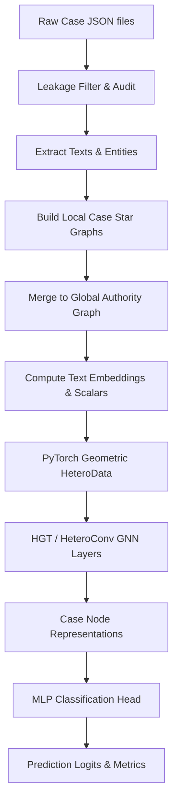
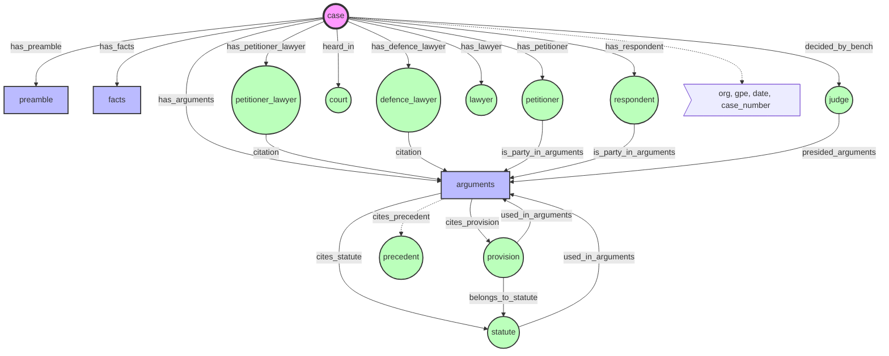
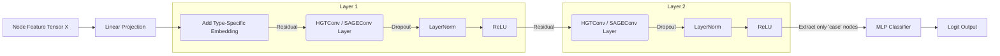

# Pre-Judgment Legal Outcome Prediction: GNN Architecture & Pipeline Documentation

This document provides a comprehensive technical overview of the Graph Neural Network (GNN) pipeline designed for pre-judgment legal outcome prediction. It details exactly how the data is structured, where specific features are stored, how the graph is constructed, and the internal operations of the GNN model itself.

---

## 1. Pipeline Overview

The high-level data flow operates in three distinct phases:
1. **Preprocessing (`src/preprocessing/`)**: Ingests JSON files, aggressively filters out outcome-leaking fields (like `decision_text`, `ANALYSIS` sections, and phrases like "petition dismissed"), and audits the excluded data.
2. **Graph Construction (`src/graph/`)**: Builds Local Case Star Graphs for each case, merges them into a Global Authority Graph sharing common legal entities, and transforms the structure into a PyTorch Geometric `HeteroData` object. Text and scalar features are attached to nodes at this stage.
3. **Training & Representation (`src/models/`, `src/training/`)**: Passes the HeteroData through a Heterogeneous Graph Transformer (HGT) network to aggregate neighbor representations up to the root `case` nodes, which are then classified by an MLP head.

---

## 2. Graph Schema: Nodes and Connections

The pipeline employs a heterogeneous graph. A single "Case Star Graph" represents one legal proceeding. The graph is centered around the **`case`** node.

### Node Types
The nodes belong to three broad categories:
* **The Root Node**: `case`
* **Text Nodes**: `preamble`, `facts`, `arguments`
* **Entity/Authority Nodes**: `petitioner`, `respondent`, `court`, `judge`, `lawyer`, `petitioner_lawyer`, `defence_lawyer`, `statute`, `provision`, `precedent`, `org`, `gpe`, `date`, `case_number`

### Edge Connections (Topology)
Connections dictate how messages (information) flow between nodes during the GNN's forward pass. Note that the graph undergoes a `ToUndirected()` transformation before training, meaning messages can flow symmetrically.

### The Global Graph Merge
While text nodes (`preamble`, `facts`, `arguments`) and party nodes (`petitioner`, `respondent`) are strictly unique and bound to their specific `case`, **Authorities and Context entities are shared across cases**. 
A `judge`, `court`, `statute`, or `provision` appearing in multiple cases will become a single unified node in the global graph. This allows the GNN to learn authority-level patterns (e.g., "Judge X frequently presides over this specific legal issue involving Statute Y").

---

## 3. Data Representation: What is Stored and How?

Nodes in the PyTorch Geometric HeteroData object (`data[node_type].x`) are represented by dense numeric tensors.
**Formula:** `node_feature_vector = CONCAT(text_embedding, scalar_features)`

### A. Text Embeddings (`embedding_dim` = e.g., 384 or 768)
- Every node has an associated text string. 
    - Text Nodes: The actual text content.
    - Entity Nodes: The canonical name of the entity.
    - Case Node: Minimal descriptive text.
- Text strings are converted into dense vectors using a backend `SentenceTransformer` model (or a fallback hashing encoder). 
- **Where it is stored**: Generated in `src/utils/text_encoder.py`, saved locally in `data/embeddings_cache/`, and loaded directly into memory array during graph build.

### B. Scaled Scalar Features (`scalar_dim` = variable, e.g., 12)
Manually engineered features specific to the node type are concatenated to the text embedding. All scalars are scaled between `[0, 1]` to ensure gradient stability.

**`case` node scalars:**
- `respondent_count` / `judge_count` / `lawyer_count` / `statute_count` / `provision_count` / `precedent_count`
- text lengths (`preamble_length`, `facts_length`, `arguments_length`)
- temporal feature (`case_year`)
- `petition_type_known` & `petition_type_hash`

**Text node scalars (`preamble`, `facts`, `arguments`):**
- Text length
- One-hot indicator of its node type (is_preamble, is_facts, is_arguments)
- (For Arguments): `cited_statute_count`, `cited_provision_count`, `lawyer_counts`, `party_counts`

**Entity node scalars (`judge`, `court`, `lawyer`, `statute`, etc.):**
- `mention_count` and `local_case_frequency`
- `global_case_frequency` (highly crucial for shared nodes)
- `degree` (number of connected edges)
- `first_seen_section` one-hot (e.g., first seen in arguments vs preamble)
- `is_shared_node`

---

## 4. GNN Model Architecture

The core of the network evaluates these massive interconnected graphs.

**Where the code is:** `src/models/hetero_gnn.py`

### 1. Initialization and Projection mapping
Before message passing, every node type has varied input dimensions depending on the text encoder used. The framework first applies linear layers `input_projections` independently per node-type to project all inputs to a unified `hidden_dim` (e.g., 128). An additional learnable parameter `type_embeddings` is added to give the model global context of "what type" of node it is currently looking at.

### 2. Message Passing (HGT / HeteroConv)

The architecture supports different backends (default: `HGTConv` - Heterogeneous Graph Transformer). 
- **HGT**: Calculates mutual attention scores between node pairs (e.g., how much attention should a `case` pay to its `judge` vs its `arguments`). The weights for projecting keys, queries, and values depend intrinsically on the `node_type` and `edge_type` metadata. 
- Over `num_layers` (default: 2), nodes aggregate information iteratively from their direct neighbors, then neighbors-of-neighbors. Thus, in a 2-layer setting, the `case` node natively gathers features from the `provision` (Path: `case -> arguments -> provision`).

### 3. Stability Components
Inside the forward pass loop:
- **Residual connection**: `residual + message`
- **Dropout**: applied immediately to the incoming message (default: `p=0.2`).
- **Layer Normalization**: Applied independently per node-type to stabilize multi-hop aggregation.
- **ReLU**: Non-linearity applied post-normalization.

### 4. Downstream Classification (`src/models/mlp_head.py`)
Because the objective is "case outcome prediction", the pipeline discards all entity and text node representations post-message passing. It isolates the `hidden` representations strictly for `case` nodes, passing them through an MLP (Multi-Layer Perceptron) with standard linear/dropout geometry to yield the final classification logits (e.g., Won / Lost). Split masking (`train_mask`, `test_mask`) is strictly applied on these case nodes during loss calculation.

---

## 5. Security & Leakage Prevention Mechanism

Because this GNN operates purely on pre-judgment conditions, extreme measures exist at `src/graph/schema.py` and `src/preprocessing/leakage.py`.

- Nodes generated from `case_outcome_label` or `decision_text` are strictly blocked.
- Assertions dynamically read through JSONs during graph building (`run_graph_quality_checks` in `src/graph/pyg_builder.py`) and crash if any node contains phrases like `appeal allowed` or strings mapped to `RPC` (Rhetorical Role for Final Decision).
- This ensures the GNN only trains on semantic attributes that existed before the judgment was inked.
