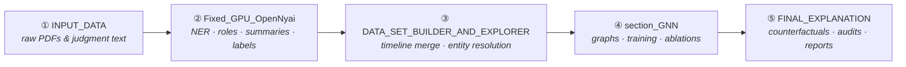

<div align="center">

# ⚖️ Legal Case Outcome Prediction & Explanation<br>with Heterogeneous Graph Neural Networks

**An end-to-end, leakage-aware pipeline for Indian court judgments — from raw PDF text to
structured case graphs, HGT outcome models, and faithful counterfactual explanations.**

*Capstone Thesis repository · accompanying paper accepted for conference publication* 🎉

</div>

---

## 🧭 Overview

This repository contains the complete research pipeline behind the thesis:

> For a source-to-artifact methodology, including the exact final-model lineage,
> corpus/graph statistics, and known reproducibility boundaries, see
> **[`FRAMEWORK_AND_DATA_ACQUISITION.md`](FRAMEWORK_AND_DATA_ACQUISITION.md)**.

- **Extraction** — OpenNyAI named-entity recognition, rhetorical-role segmentation, and
  summarization over raw judgment text, followed by Mistral-based case outcome labelling.
- **Dataset construction** — merging per-hearing records into case timelines, building
  cross-bucket datasets, and canonicalizing statutes/provisions/precedents via entity resolution.
- **Modelling** — heterogeneous "case-star" graphs over five legal domains, trained with
  HGT-style graph neural networks under K-fold cross-validation, plus a full ablation and
  encoder-comparison matrix (BGE-M3 vs InLegalBERT) and cross-domain tests.
- **Explanation** — typed counterfactual explanations of the frozen model, faithfulness
  validation, identity-shortcut audits, community/full-graph analyses, traceability reports,
  and interactive visualisers.

The five core legal domains (*buckets*) are **family & matrimonial**, **financial fraud**,
**land & property**, **motor accidents**, and **sexual offences**, with **food safety** held
out for cross-domain evaluation.

---

## 🗺️ The Pipeline at a Glance

Run (and read) the main folders **in this order**:



| Stage | Folder | What it does | Key outputs |
|:-----:|--------|--------------|-------------|
| ① | [`INPUT_DATA/`](INPUT_DATA/README.md) | Raw & extracted judgment text per legal domain; PDF → text extraction | `<domain>_text/*.txt` |
| ② | [`Fixed_GPU_OpenNyai/`](Fixed_GPU_OpenNyai/README.md) | OpenNyAI NER + rhetorical roles, summaries, Mistral outcome labels | `final_outputs/<bucket>_labelled_mistral/labelled_jsons/` |
| ③ | [`DATA_SET_BUILDER_AND_EXPLORER/`](DATA_SET_BUILDER_AND_EXPLORER/README.md) | Merges hearings into case timelines, builds cross-bucket datasets, resolves entities | `Timeline_Maker/output_merged_v3_resolved/` |
| ④ | [`section_GNN/`](section_GNN/README.md) | Preprocessing, graph caches, HGT training, ablations, cross-domain & multi-hearing tests | `outputs/.../kfold/kfold_summary.json` |
| ⑤ | [`FINAL_EXPLANATION/`](FINAL_EXPLANATION/README.md) | Post-hoc explanation, validation, audits, traceability reports, paper figures | `outputs/entity_resolved_section_sep_lr_decay_cross_bucket_*` |

---

## 🖥️ Interactive Visualisers

For an examination or demo, use the unified dashboard. It starts every populated app,
shows live links on one landing page, and puts the four examiner-facing questions first:

1. **NER + rhetorical roles** — what was extracted from each judgment?
2. **Explainability** — why did the frozen HGT make a prediction?
3. **Multi-hearing cases** — how did the prediction change across hearings?
4. **Early detection** — how soon did the prediction match the final outcome?

```bash
python3 run_visualisers.py
```

Open `http://localhost:8090`. The launcher also prints one SSH command containing all
required port forwards for a remote examiner. Use `--no-extras` to start only the three
apps containing the four priority views, or `--host 0.0.0.0` when the server and its app
ports are deliberately exposed on a trusted network.

The hub includes two supplementary tools after the priority views: the legal case graph
and entity-network analysis. Every card is backed by the existing generated outputs and
shows a few headline counts to help an examiner orient themselves before opening it. The
NER/RR inventory is counted directly from the current non-empty annotation files rather
than from historical run summaries.

The individual launchers remain available:

| Visualiser | Role | Port | Launch | Env |
|------------|:----:|:----:|--------|-----|
| **Multi-Hearing Stage Test Visualiser** | ⭐ main | `8050` | `bash section_GNN/multi_hearing_stage_test/visualiser/run_app.sh` | `graph_vis` |
| **Final Explanation Visualizer** | ⭐ main | `8899` | `bash FINAL_EXPLANATION/run_scripts/run_visualizer.sh` | `thesis_work` |
| **Graph Visualiser** | ➕ extra | `8050` | `bash GRAPH_VISUALISER/run_app.sh` | `graph_vis` |
| Pipeline Stage Visualiser | 🔧 auxiliary | `8053` | `bash STAGE_VISUALISER/run_app.sh` | `graph_vis` |

> **Note** — the Multi-Hearing Stage Test Visualiser and the Graph Visualiser both default to
> port **8050**: run them one at a time, or pass an alternative port as the first argument
> (e.g. `bash GRAPH_VISUALISER/run_app.sh 8051`). On a remote server, tunnel first:
> `ssh -L <port>:localhost:<port> <user>@<server>`.

There is also an entity co-occurrence sub-app
(`bash GRAPH_VISUALISER/entity_analysis/run.sh both 8052`).

---

## 📁 Repository Map

| Folder | Purpose |
|--------|---------|
| [`INPUT_DATA/`](INPUT_DATA/README.md) | **Stage ①** — raw/extracted judgment text per domain (data ignored by Git). |
| [`Fixed_GPU_OpenNyai/`](Fixed_GPU_OpenNyai/README.md) | **Stage ②** — GPU OpenNyAI extraction + Mistral labelling pipeline. |
| [`DATA_SET_BUILDER_AND_EXPLORER/`](DATA_SET_BUILDER_AND_EXPLORER/README.md) | **Stage ③** — Timeline Maker: merging, cross-bucket datasets, entity resolution. |
| [`section_GNN/`](section_GNN/README.md) | **Stage ④** — GNN modelling: graphs, training, ablations, encoder matrix. |
| [`FINAL_EXPLANATION/`](FINAL_EXPLANATION/README.md) | **Stage ⑤** — post-hoc explanation, validation, audits, reports, figures. |
| [`GRAPH_VISUALISER/`](GRAPH_VISUALISER/README.md) | Extra Dash graph explorer + static thesis figure generation (port 8050). |
| [`STAGE_VISUALISER/`](STAGE_VISUALISER/README.md) | Auxiliary stage-by-stage pipeline inspector (port 8053). |
| [`model comparison/`](model%20comparison/README.md) | Legal-LLM baselines (InLegalLlama, FactLegalLlama) on held-out GNN test cases. |
| [`posthoc_case_reports/`](posthoc_case_reports/README.md) | Case-level CSV reports connecting explanations to timelines/stages. |
| [`Latex_Documentation/`](Latex_Documentation/README.md) | Thesis & paper LaTeX sources, figure-generation helpers. |
| [`requirements/`](requirements/README.md) | Index of the micromamba environments used across the repo. |
| `run_visualisers.py` | One-command local hub for the repo's visualisers. |
| `DUMP_MISC/` | 🗄️ Archive of deprecated scripts, old experiments, and superseded outputs — not part of the active pipeline. |

---

## 🧪 Environments

Different stages have incompatible dependency constraints, so each uses its own micromamba
environment. Package inventories live in [`requirements/`](requirements/README.md).

| Environment | Used by |
|-------------|---------|
| `fixed_gpu_opennyai_final` | OpenNyAI NER/rhetorical-role extraction and summarization (Stage ②). |
| `llm` | Mistral outcome labelling (Stage ②). |
| `case_merge` | Lightweight timeline/case merging (Stage ③). |
| `thesis_work` | `section_GNN` preprocessing, graph building, training, and `FINAL_EXPLANATION` analyses (Stages ④–⑤). |
| `graph_vis` | Dash visualisers (Graph, Stage, Multi-Hearing). |
| `hgt_trace_reports` | Traceability report generation (Stage ⑤). |
| `model_comparison_inlegalllama` | Legal-LLM comparison runs. |

---

## 🚀 End-to-End Quick Start

```bash
# ① Extract text from PDFs (if starting from PDFs)
python INPUT_DATA/01_extract_pdf_text.py --input-dir <pdf_dir> --output-dir INPUT_DATA/<domain>_text

# ② OpenNyAI extraction → summaries → Mistral labels → timeline merge
cd Fixed_GPU_OpenNyai
bash run_scripts/run_ner_rr_all_categories.sh --gpus 0,1,2,3
bash run_scripts/run_opennyai_summaries_all.sh --gpus 0,1,2,3
bash run_scripts/run_mistral_labels_from_opennyai_summaries_all.sh --gpus 0,1,2,3
bash run_scripts/run_merge_timeline_from_final_outputs.sh
cd ..

# ③ Build the cross-bucket dataset and resolve entities
cd DATA_SET_BUILDER_AND_EXPLORER/Timeline_Maker
python merge_cases_v3.py            # see folder README for arguments
python entity_resolver/resolve_entities.py --input-root output_merged_v3 --output-root output_merged_v3_resolved
cd ../..

# ④ Preprocess → build graph → K-fold training (one bucket shown)
cd section_GNN
bash runs/fin_fraud_timed_mistral/run_all.sh
cd ..

# ⑤ Full explanation + validation + audits + pattern/full-graph analyses
bash FINAL_EXPLANATION/run_scripts/run_entity_resolved_section_sep_lr_decay_cross_bucket_all.sh

# 🔍 Inspect the results
bash FINAL_EXPLANATION/run_scripts/run_visualizer.sh          # http://127.0.0.1:8899
```

Each folder README documents the exact inputs, outputs, flags, and environment for its stage.

---

## 📐 Repository Policy & Reproducibility

- **Source-first Git policy.** Scripts, configs, READMEs, LaTeX sources, and compact figures
  are versioned. Large generated corpora, model checkpoints, graph caches, embedding arrays,
  runtime homes, and logs are kept local and ignored by Git.
- **Portable paths.** Active configs and wrappers use repository-relative paths
  (e.g. `../DATA_SET_BUILDER_AND_EXPLORER/...`); nothing depends on a machine-specific
  absolute path. Python configs are loaded through resolvers that expand these at runtime.
- **Run from the documented folder.** Each README states where to launch its commands from —
  most `section_GNN` tooling expects `cd section_GNN` first.
- **Adding experiments.** Place the config + `run.sh` next to the closest existing variant,
  keep paths relative, and document inputs/outputs/environment in a local README.

---

<div align="center">

**Start here:** [`INPUT_DATA/`](INPUT_DATA/README.md) → [`Fixed_GPU_OpenNyai/`](Fixed_GPU_OpenNyai/README.md) → [`DATA_SET_BUILDER_AND_EXPLORER/`](DATA_SET_BUILDER_AND_EXPLORER/README.md) → [`section_GNN/`](section_GNN/README.md) → [`FINAL_EXPLANATION/`](FINAL_EXPLANATION/README.md)

</div>
