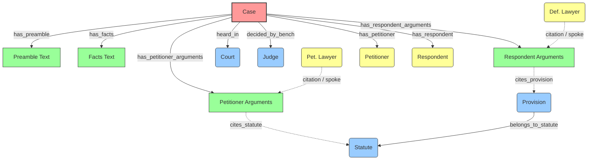

# GRAPH_SCHEMA 

This document defines the highly structured structural topology generated and passed into the `HGTConv` networks within the section_GNN framework.

## 1. High-Level Graph Topology (The "Star")

The `Case` node is at the center. Textual components and global structural identities ring the perimeter. The reason it's considered a "Heterogeneous Star" is that each *type* of relationship (e.g., `(case, decided_by_bench, judge)`) carries distinct semantic meaning, and separate transformation matrices are optimized per edge-type.

## 2. Node Types & Significance

### Central Node
* **`case`**: The ultimate anchor. Has structured scalar features (Counts of players, normalized length, petition year).

### Text Nodes (Get 384d / 512d Dense Text Embeddings)
* **`preamble` / `facts`**: Clean context vectors.
* **`arguments`**: If unified, the full combined rhetoric blocks.
* **`petitioner_arguments` / `respondent_arguments` / `other_lawyer_arguments`**: Fragmented subset arguments, created by associating the text nearest to a `LAWYER` extraction whose contextual window maps to a party.

### Structural Entity Nodes (Get scalar frequencies)
* **`court` / `judge`**: Systemic variables.
* **`statute` / `provision`**: Structural points of explicit legal rules.
* **`petitioner` / `respondent`**: Who is litigating.
* **`precedent`**: Direct citations to previous cases.

---

## 3. Edge Types (Categorization)

Edges dictate *Message Passing*. In `HeteroLegalOutcomeGNN`, messages flow from `$SRC$` to `$DST$` via an Edge.

### **Category A: Pure Structural (Centrifugal)**
Anchors things explicitly found within a single file. Highly local.
* `(case, has_preamble, preamble)`
* `(case, heard_in, court)`
* `(case, has_petitioner, petitioner)`

### **Category B: Citation and Bridging (Centripetal Accelerators)**
Graph depth in standard GNNs results in over-smoothing (where every node looks the same). Bridging prevents this.
* **`citation` edges**: E.g., `(petitioner_lawyer, citation, petitioner_arguments)`. A lawyer does not just "belong to the case", they are structurally responsible for their *specific text chunk*.
* **`used_in_arguments` / `cites_statute`**: Rather than a `statute` just linking idly to the `case`, it maps strictly to the `arguments` chunk where it was referenced, providing immense inductive value.

### **Category C: Hierarchical Structure**
* `(provision, belongs_to_statute, statute)`

---

## 4. Feature Schemas

How does a graph encode these mathematically?

Data injected via `src/graph/pyg_builder.py`:
1. **Sentence Transformers Embeddings**: For text nodes, the explicit `text_length`, combined with the contextual MiniLM outputs `matrix[idx]`.
2. **Scalars**: Case node attributes scaled linearly.
   * `respondent_count` => divided by `100.0`.
   * `preamble_length` => bounded and divided by `5000.0`.
   * `case_year` => zeroed from `1900.0` to `200.0`.

This results in a uniform `feature_dim` (e.g. `384` + `14` scalar = `398`) assigned mapped to a PyTorch Geometric `data.x_dict[type]`. Everything runs smoothly into PyTorch `nn.Linear`.
