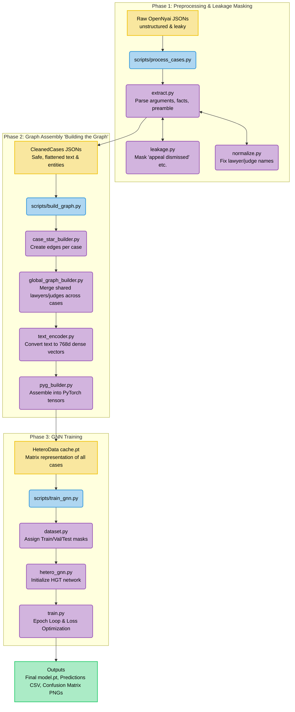
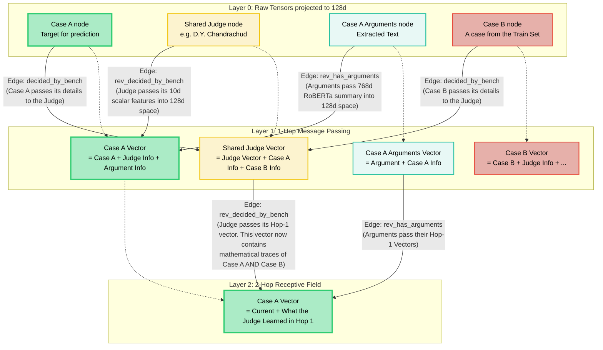

# Detailed Pipeline & Architecture Theory Guide

This document is a comprehensive guide to understanding both the theoretical concepts and the exact practical flow of the `section_GNN` codebase. It answers what a heterogeneous graph is, what "building a graph" means, what layers are, and how the pipeline executes from raw text to legal outcome predictions.

---

## Part 1: Core Concepts Explained

Before analyzing the pipeline diagrams, it is critical to understand the foundational concepts driving this codebase.

### What is a "Heterogeneous Graph Structure"?
A **graph** is a mathematical structure consisting of nodes (entities) and edges (connections).
* **Homogeneous Graph:** A graph where every node and every edge is exactly the same type. Think of a social network where every node is a "User" and every edge is "Friends With".
* **Heterogeneous Graph:** A graph with *different types* of nodes and edges working together. 
  * In the codebase, we have node types like `case` (the legal dispute), `judge` (the person deciding), `preamble` (textual context), and `petitioner_lawyer` (legal counsel). 
  * We have entirely distinct edge types connecting them. For example, a `(case)-[decided_by_bench]->(judge)` is completely different from a `(case)-[has_preamble]->(preamble)`.
  * **Why this matters:** Treating a legal document as a heterogeneous graph allows the model to map the complex structure of real law. Instead of reading a 50-page document blindly from start to finish like ChatGPT, we segment the people from the sections, and connect the actual `statute` used to the exact `arguments` where it was cited.

### What Does "Building the Graph" Mean?
At the start, legal data is just text stored in a JSON file. Neural networks cannot read English strings; they only read matrices of numbers (tensors).

"Building the graph" is the computational process of doing the following:
1. **Extracting Entities:** Finding every unique judge, lawyer, and case number across all JSONs.
2. **Embedding Text:** Converting text chunks (like the `facts` section) into a dense array of numbers (e.g., an array 768 elements long). The codebase uses Hugging Face models (like Legal-RoBERTa) or sentence-transformers to do this.
3. **Establishing Edges (`edge_index`):** Creating pairs of integers that dictate which nodes are linked. If Case #50 is connected to Judge #12, we create an entry `[50, 12]` under the relation type `decided_by_bench`.
4. **PyG Construction:** Wrapping all of these separate numeric matrices into a single, standardized PyTorch Geometric (`HeteroData`) container that can be natively loaded into a GPU.

### What is a "Layer" in a GNN?
In image recognition, a layer extracts visual features (edges, corners).
In a GNN, **a "layer" is a single "hop" of message passing over the graph edges.**

* **Layer 0 (Initial State):** A `case` node only knows about the text inside itself and its basic metadata.
* **Layer 1 (The First Hop):** The `case` node asks its immediate neighbors (the `judge`, the `preamble`, the `lawyer`) to send over their numeric information. The `case` node aggregates this data, processes it, and updates its own numeric state.
* **Layer 2 (The Second Hop):** The `case` node repeats the process. However, because its neighbors *also updated themselves during Layer 1*, the `judge` is now sending information it gathered from *other cases it presided over*. 
* **Depth = Receptive Field:** If you have 3 layers, every node is influenced by information up to 3 connections away.

### What is 'HGT' (Heterogeneous Graph Transformer)?
HGT is the specific mathematical formula we use to perform the "Message Passing" described above.
* A standard GNN treats all incoming messages identically. If a `judge` and a `statute` send a message to the `case`, a standard GNN simply averages them together.
* **HGT is smart.** It uses attention mechanisms tailored to specific relation types. It learns a completely distinct mathematical transformation for the edge `(case)-[decided_by_bench]->(judge)`. By doing this, it learns how heavily to weigh a specific judge's history vs. a specific argument phrase.

---

## Part 2: The End-To-End Data Pipeline

This flowchart shows how raw, unstructured text turns into a PyTorch-ready matrix, and finally runs through the training loops.



---

## Part 3: Advanced GNN Architecture Mapping

This chart visualizes the exact forward pass occurring inside `HeteroLegalOutcomeGNN`. You will see how matrices physically map through the layers.

```mermaid
flowchart LR
    classDef tensor fill:#e8f8f5,stroke:#1abc9c,stroke-width:2px,color:#000
    classDef operation fill:#fcf3cf,stroke:#f1c40f,stroke-width:2px,color:#000
    classDef network fill:#fdebd0,stroke:#e67e22,stroke-width:2px,color:#000
    classDef metrics fill:#fadbd8,stroke:#e74c3c,stroke-width:2px,color:#000

    IN_TXT("Text Nodes Array<br/>x: [NodeCount, 768]"):::tensor
    IN_ENT("Entity Nodes Array<br/>x: [NodeCount, 10]"):::tensor
    
    subgraph L0 [Layer 0: Projection Setup]
        PROJ_TXT(nn.Linear<br/>Map to 128d):::operation
        PROJ_ENT(nn.Linear<br/>Map to 128d):::operation
        ADD_EMB(Add Learnable<br/>Type Embeddings):::operation
        
        IN_TXT --> PROJ_TXT --> ADD_EMB
        IN_ENT --> PROJ_ENT --> ADD_EMB
    end
    
    H_STATE{"Target Node<br/>Hidden State"}:::tensor
    ADD_EMB --> H_STATE
    
    subgraph LAYER [GNN Layer loop runs N times]
        direction TB
        MSG("Neighbor Nodes"):::tensor
        HGT("HGT Layer<br/>Transforms messages via attention tailored to edge type"):::network
        AGGR("Aggregator<br/>Combines neighbor messages"):::operation
        RES("Residual Connection + Dropout"):::operation
        NORM("LayerNorm + ReLU"):::operation
        
        MSG --> HGT --> AGGR --> RES --> NORM
    end
    
    H_STATE --> LAYER
    NORM -- Updated hidden state --> H_STATE
    
    subgraph OUT [Readout & Classification]
        S_CASE("Slice out 'case' nodes<br/>from final hidden state"):::operation
        MLP("MLP Head<br/>Linear -> ReLU -> Linear"):::network
        LOGITS("Logits array [NumCases, 3]"):::tensor
        
        S_CASE --> MLP --> LOGITS
    end
    
    H_STATE -. After N hops .-> S_CASE
    
    subgraph LOSS [Supervision]
        MASK("Apply Train Mask<br/>slice out Val/Test"):::operation
        CE("Cross Entropy Loss"):::metrics
        
        LOGITS --> MASK --> CE
    end
```



---

## Part 4: Receptive Fields & Exact Message Flow (Hop by Hop)

This diagram breaks down exactly what occurs during "Hop 1" and "Hop 2" of the message passing layers. It shows **exactly what embeddings** are passed across reverse edges in a global graph containing multiple cases.

Because the code converts graphs to "undirected" networks (meaning data flows both ways on every edge), a shared central node like a `Judge` creates a massive bridge.



### What Data is "Missed" or Lost During These Hops?

While GNNs are powerful, the specific implementation of this pipeline loses data during the hopping iterations due to strict structural constraints:

1. **Edge Attributes/Weights are Missing:** The graph structure only uses `edge_index` (connectivity). If "Case A" heavily referenced "Judge X", and "Case B" barely referenced them, the `decided_by_bench` connection treats both equally. There are no Edge Weights passing through the multi-head attention to indicate the intensity of a connection.
2. **Path Distance Cutoffs (Bridging Failures):** The network defaults to 3 Layers (3 hops limit). If a `lawyer` failed to be matched to an `arguments` node during the heuristic NLP regex preprocessing, that lawyer only connects to the `case`. Meaning it takes 2 full hops for the argument text to even mathematically interact with the lawyer representing it.
3. **Over-Squashing (The 128d Bottleneck):** Every piece of text (a staggering 768-dimensional legal argument) and every structural node is instantly projected down to just `128d` in Layer 0. When a node like `Judge` accepts messages from 50 cases in Layer 1, it must mathematically squash the context of 50 complex cases into a single 128-dimensional vector. Huge nuance is lost to aggregation average-pooling.
4. **Information Transductive Bleed:** As seen in Layer 2 of the diagram, because nodes like `Judge` and `Statute` are **global** (shared across the train and test splits organically), training on `Case B` updates the `Judge` embeddings, which then seep into predictions for `Case A` (even if Case A is in the Test Set). This isn't technically "lost" data, but it is "leaked" external data skewing the message pass explicitly.

## Training & Split Policy (Transductive Masking)

Supported physical split assignments:

- `random`
- `year`
- `court`

The architecture treats the dataset as a **transductive global graph**. This has major implications for how training and evaluation work:

### 1. The Global Forward Pass
During every epoch, the GNN doesn't look at cases one-by-one. It feeds the **entire global graph** (containing every Train, Val, and Test case) into the network simultaneously. By the end of the forward pass, the model outputs a prediction (a `logit` probability) for **every single case node** at once.

### 2. The Masking Trick
To prevent the model from cheating on the Test set, every `case` node holds a boolean array flag (`train_mask`, `val_mask`, or `test_mask`).

### 3. Calculating Loss (Training)
When calculating the Error/Loss to actually update the neural network weights, the PyTorch code mathematically "slices" the predictions.
```python
loss = cross_entropy_loss(logits[train_mask], true_labels[train_mask])
```
The GNN generated predictions for the Val and Test cases, but the optimizer completely ignores them. The model's weights are updated **exclusively based on its performance on the `train_mask` cases**.

### 4. Evaluation 
During validation or testing, the exact same slicing happens, but targeting the respective mask:
```python
val_metrics = calculate_metrics(logits[val_mask], true_labels[val_mask])
```

### The Transductive "Leak" Caveat
Because the full graph is evaluated simultaneously, and nodes like `[judge]` are global, the embeddings of the `Train` cases pass messages to the `Judge` taking their labels implicitly with them. In the *same forward pass*, that updated `Judge` passes messages into the `Test` cases. The model never explicitly peeks at the Test **labels**, but the structural mathematical context of the Train set profoundly influences the Test cases during message passing.

## Known Limitations

- Entity normalization is conservative and string-based, not a full legal entity resolver.
- Party nodes are local by default to avoid unsafe cross-case merges.
- The dataset is small and class-imbalanced, so validation and test F1 can be unstable.
- The first version does not use raw full-text sentence graphs or dense case similarity edges.
- `ANALYSIS` is conservatively excluded to avoid post-judgment reasoning leakage, which may remove some potentially useful but risky context.

EXTRA INFO - REGARDING LAWYER SIDE:

uses a two-step "heuristic" (rule-based pattern matching) to figure out which side an argument belongs to. This logic lives inside src/preprocessing/extract.py in the _infer_argument_bucket and _infer_lawyer_side functions.

Here is exactly how it makes the decision for every chunk of text labeled as "arguments":

1. The Predefined Signal Lists
The code maintains specific lists of keywords for each side:

Petitioner Signals: "for appellant", "counsel for petitioner", "adv. for petitioner", etc.
Respondent Signals: "for respondent", "for the state", "public prosecutor", "government pleader", "a.p.p.", etc.
Neutral / Unknown Signals: "learned counsel", "counsel submitted", "appeared for".
2. Step One: Proximity to an Extracted Lawyer Name
When it looks at a chunk of argument text, it first checks if the NLP model successfully highlighted a LAWYER entity inside that text. If it finds a lawyer's name, it grabs a "window" of raw text around that name (300 characters before the name, 150 characters after).

It then scans that window for the signals:

If it finds a petitioner signal (e.g., "Mr. Smith, counsel for petitioner"), it labels the entire argument text as petitioner_arguments.
If it finds a respondent signal, it labels it respondent_arguments.
3. Step Two: Fallback Plain Text Scan
If it couldn't find a LAWYER name, or the window around the name was confusing, it falls back to scanning the entire argument chunk.

If the chunk contains phrases like "counsel for appellant argued that...", it throws it into the petitioner_arguments bucket.
If it contains things like "the public prosecutor contended that...", it throws it into the respondent_arguments bucket.
4. Step Three: The Neutral Bucket
If it clearly detects argumentative language (e.g., "counsel submitted") but cannot find any explicit words identifying whether it's for the petitioner or respondent, it safely groups it into a fallback bucket called other_lawyer_arguments.

Ultimately, all of these categorized chunks are sorted and saved into your cleaned_cases JSONs under those exact bucket names.